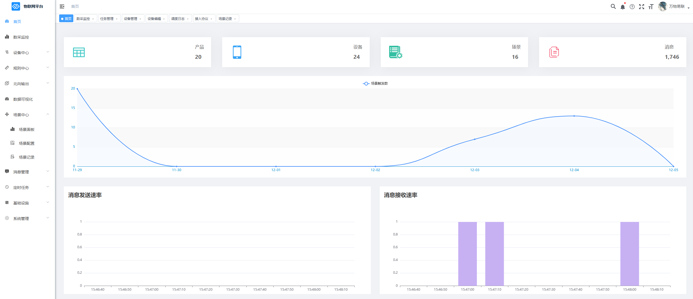
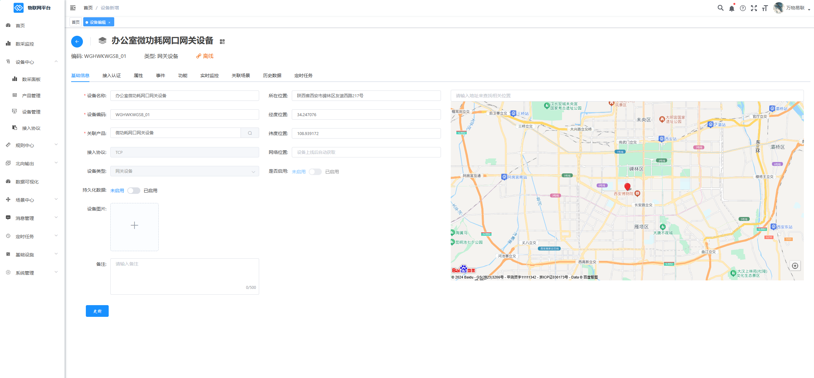
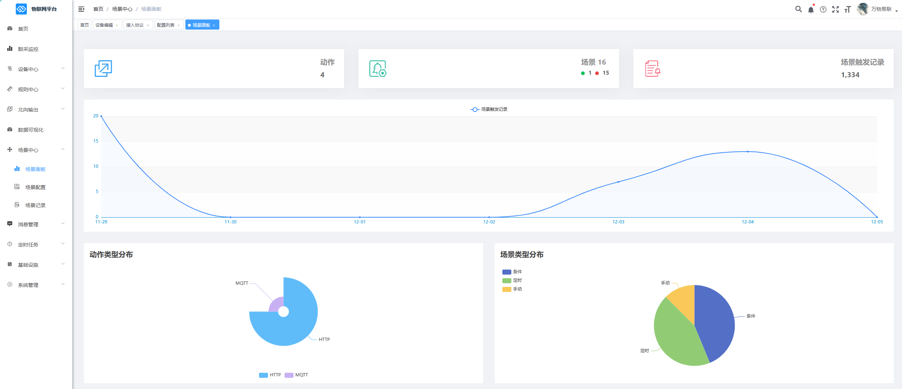
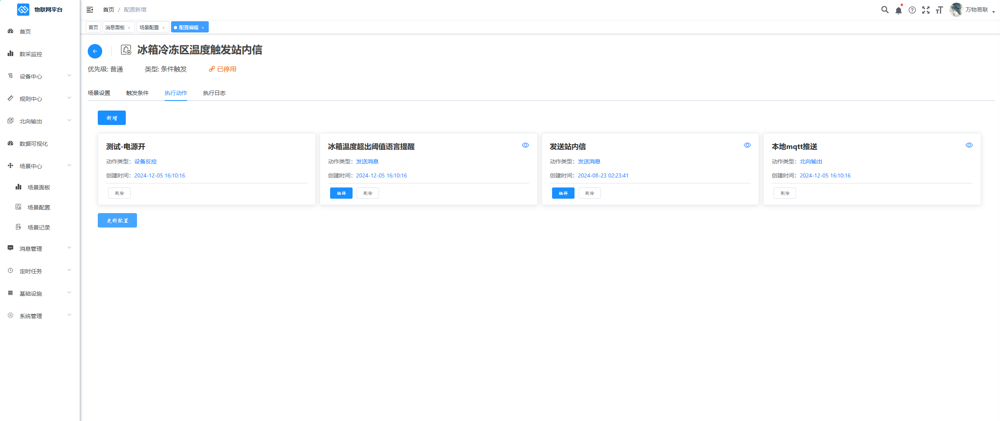
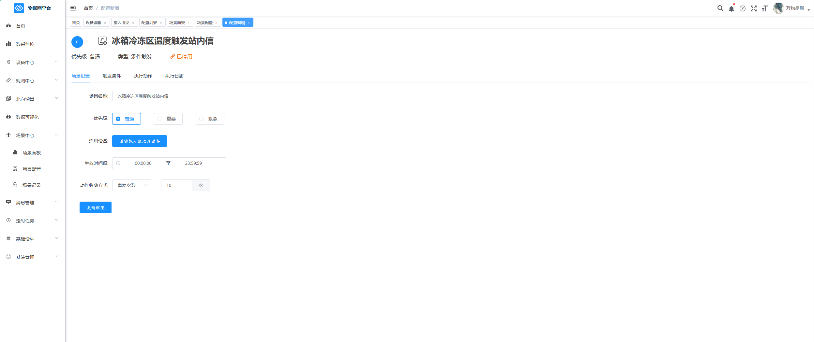
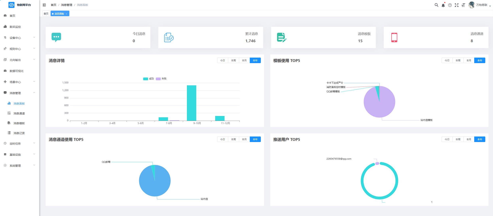

<h3 align="center">🌏  新一代物联网云平台</h3>

       

 

### 介绍
* **概述**

    e-link 是新一代物联网设备统一接入平台，帮助客户在极短的时间内搭建个性化的物联网平台和应用，并适应不断变化的发展需求。目前广泛应用于制造、电力、能源、环境、农业、楼宇、家居、教育、交通、物流、自动化等领域。
* **特性**

    e-link 可接入各类网关，传感器、执行器、控制器、通信模组、智能硬件等，实现数据采集、远程控制，数据分析、告警通知、智能联动。
* **能力**

    e-link 既可以配合传感器、网关、DTU 等设备快速搭建一套数据采集方案，也可以帮助智能硬件接入云端实现远程控制或设备联动等功能，还可以与多种硬件结合实现物联网行业解决方案，并为物联网应用提供了无限可能。

欢迎交流沟通：QQ：419300698

支持作者请Star

### 文档链接
[系统部署](https://jp0gmbtpep.feishu.cn/docx/QovLdAtxooVFbmxbs7bc6jcJnnc?from=from_copylink)

[接入设备](https://jp0gmbtpep.feishu.cn/docx/Tzgbd3U5EocPyPx3RZzcDwrKnOh?from=from_copylink)

[在线体验](http://111.21.251.50:81/login)(账号：demo,密码：123456)

### 功能列表

设备中心：产品分类、产品管理、设备管理、父子设备管理、接入协议、消息转换、数据看板。

北向输出：支持通过MQTT、HTTP协议对接第三方平台，快速实现数据贯通。

规则中心：针对开源项目Node-Red进行二次开发，支持常见工业协议和MQTT协议的互转，实现多种类型设备的灵活接入。

设备监控：提供多样式图表展示设备实时数据，设备状态一目了然。

场景中心：提供条件、定时、手动三种场景策略，并与北向输出、消息中心深度结合，满足设备日常告警通知、周期性执行任务、数据二次计算等需求。

流计算引擎：支持处理海量设备数据，多方式数据处理和分析，并且支持多种时间窗口处理策略。

消息中心：支持站内信、短信、语音、邮件、钉钉、企业微信等多种通知渠道，满足日常通知需求。

数据大屏：支持SQL、HTTP、MQTT、WEBSOCKET多种类型的数据源配置，丰富的大屏组件，快速搭建属于自己的物联网大屏。

组态看板：自研组态插件，和设备管理深度结合，实现生产设备全流程监控。

移动端: 随时随地进行设备实时监控，告警信息处理。（开发中。。。）

系统管理：用户管理、角色管理、菜单管理、部门管理、岗位管理、通知公告、日志管理

### 平台架构
系统架构
当前版本基于芋道源码前后端分离版本开发。详情请参照：https://gitee.com/zhijiantianya/yudao-cloud

 

### 目录结构

 

### 演示图

 
 

 
 

 
 

 
 

 
 

### 联系我们
如果你有任何 e-link 产品上的问题，请添加 e-link 项目团队进行交流。
